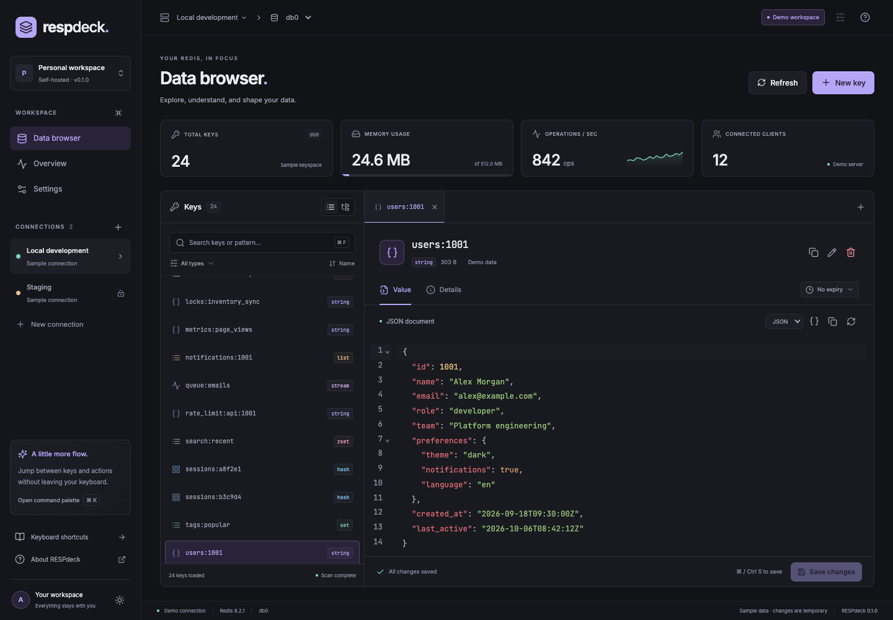

<p align="center"></p>
<h1 align="center">RESPdeck</h1>
<p align="center">A thoughtful workspace for your Redis data.</p>
<p align="center">Self-hosted · Browser-based · TypeScript · MIT</p>
<p align="center">
  <a href="https://github.com/aeke/respdeck/actions/workflows/ci.yml"></a>
  <a href="https://github.com/aeke/respdeck/releases/tag/v0.1.0-rc.1"></a>
  <a href="LICENSE"></a>
</p>
<p align="center"><a href="https://aeke.github.io/respdeck/">Website</a> · <a href="https://aeke.github.io/respdeck/demo/">Live demo</a></p>



Explore, understand, and shape your Redis data in a calm, modern interface. Run RESPdeck on your own infrastructure. No telemetry, external fonts, or third-party data services.

**[v0.1.0-rc.1](https://github.com/aeke/respdeck/releases/tag/v0.1.0-rc.1) is the first public release candidate.** Standalone Redis is supported. Cluster, Sentinel, SSH tunnels, RedisJSON modules, and multi-user access are on the roadmap.

## Features

- Light, dark, and system themes, with violet, teal, and amber accents.
- Multiple standalone connections, ACL credentials, verified TLS and custom CA certificates.
- Cursor-based SCAN browsing, pattern/type filters, virtualized lists, and namespace groups.
- Tabbed inspection and editing for strings, hashes, lists, sets, sorted sets, and streams.
- JSON formatting, binary hex previews, TTL management, collision-safe renaming and explicit deletion confirmation.
- Read-only connections enforced by the API, checked string/hash/list edits, and TTL-preserving writes.
- Live server summary, command palette, keyboard navigation, and a resizable key panel.
- A fully local demo with synthetic data. Demo edits reset on page reload.

## Quick start

### Docker

```sh
docker compose up --build -d
```

Open **http://localhost:4310**. The first visit presents a setup wizard. Read the one-time code from the application logs, create an administrator password, then optionally test and save a Redis connection or skip.

The password is stored in the data volume. No administrator password environment variable is used. A Redis encryption key is generated and persisted automatically; an existing `RESPDECK_ENCRYPTION_KEY` can be retained for deployments that already use one.

After onboarding, click **Add connection** to save additional Redis endpoints. Connections default to read-only; uncheck that option to enable editing.

You can also launch an isolated Redis alongside RESPdeck:

```sh
docker compose --profile redis up --build -d
```

Use host `redis`, port `6379` in the connection form. A Redis server on your host can be reached with `host.docker.internal` on Docker Desktop. On Linux, configure the equivalent host gateway or use a shared Docker network.

### Deploying with Coolify

Use the repository Dockerfile; its multi-stage build needs the repository as the build context. In Coolify, select the **Dockerfile** build pack, set the repository root as **Base Directory**, and use `Dockerfile` as **Dockerfile Location**.

1. Under the application configuration, set **Ports Exposes** to `4310`, assign your domain, and enable HTTPS. The server listens on `0.0.0.0:4310`; the image health check uses `/health`.
2. Set `RESPDECK_ORIGIN` to the exact public origin (for example `https://respdeck.example.com`) and `COOKIE_SECURE=true`. The first visit opens a setup wizard; read the one-time setup code from the application logs and choose an administrator password of at least 12 characters. Optionally set `RESPDECK_ENCRYPTION_KEY` to an existing 32-byte key (`openssl rand -base64 32`); new installations generate and persist a key automatically.
3. Under **Persistent Storage**, choose **Add → Volume Mount** and set **Destination Path** to `/app/data`. Leave **Source Path** empty to let Docker manage the volume. Save the mount and redeploy. The image runs as the unprivileged `node` user; the mount must be writable by UID 1000.
4. Verify `https://respdeck.example.com/health` and complete first-run setup. Back up the persistent data volume as a unit, including `respdeck.sqlite` and `encryption.key`.

Do not expose the service without HTTPS. `RESPDECK_ORIGIN` must match the browser-facing origin; incorrect origin or cookie settings can prevent sign-in.

### Development

Requires Node.js **22.22+** or Node.js 24 and pnpm 10.28.2. SQLite is built into Node; Node 22 may print an experimental SQLite warning.

```sh
corepack enable
pnpm install
pnpm dev
```

Open **http://127.0.0.1:5173**. Vite proxies `/api` to Fastify on port 4310. For real connections, configure `.env` as above and restart `pnpm dev`. `HOST`, `PORT`, and `DATA_DIR` refer to the API; Vite's development proxy expects the API on port 4310.

```sh
pnpm build
pnpm start
```

The production server serves the built UI and API at **http://127.0.0.1:4310**.

## Security and data behavior

- Real Redis endpoints remain disabled until the first-run wizard creates the administrator. One administrator session is supported; signing in invalidates the previous session. Sessions expire after eight hours.
- Redis connections are opened by the backend, never directly by the browser. Only trusted administrators should have access to this tool.
- Session cookies are HttpOnly and SameSite Strict. Writes require an allowed Origin and session CSRF token. Sign-in is rate limited.
- Saved passwords use AES-256-GCM with the persistent `<dataDir>/encryption.key`. Connection names, hosts and CA certificates are saved in SQLite.
- Back up both the data volume and the encryption key. Losing the key requires re-entering saved Redis passwords. Passwords and key values are not logged.
- For remote access, put RESPdeck behind an HTTPS reverse proxy, set `RESPDECK_ORIGIN=https://your-host`, and set `COOKIE_SECURE=true`. The Docker example binds the published port to localhost.
- New key names are limited to 4096 UTF-8 bytes. Values and collection pages are limited to 1 MiB. Oversized strings are previewed and cannot be edited; binary strings are shown as hex and cannot be edited. Binary collection entries are shown but cannot be edited in the UI. Key-level TTL/delete operations remain available on writable connections.
- SCAN is incremental, may return empty batches, and is not a database snapshot. Loaded keys are deduplicated. Namespace groups represent loaded keys, not a full-tree index. Continue scanning when more results are available.
- String edits use version checks. Hash fields and list entries compare the original value before updating. Set/sorted-set/stream operations act on the named member or ID and follow Redis semantics; RESPdeck does not provide transactions spanning multiple UI actions.
- ACL permissions must cover the operations you use. Bounded collection reads and checked mutations use `EVAL` plus the underlying commands. `INFO`, `DBSIZE`, `SCAN`, `TYPE`, and `TTL` are used for browsing; `CONFIG GET databases` is optional (falls back to 16 visible databases if denied, capped at 64).
- Redis module-specific types are identified but are not editable in this release. There is no arbitrary command console or FLUSH action.

Authenticated API documentation: **`/api/docs`**. Health endpoint: **`/health`**.

## Quality checks

```sh
pnpm check
pnpm exec playwright install chromium
pnpm test:e2e
```

Real Redis tests require a **dedicated disposable Redis server**. Integration tests clear database 15 and modify a temporary ACL user; the large-keyspace E2E test and benchmark clear database 14; never point them at a shared server.

```sh
docker run --rm -d --name respdeck-test-redis -p 127.0.0.1:6399:6379 redis:8.2-alpine
pnpm test:integration
RUN_REDIS_E2E=1 pnpm test:e2e
docker stop respdeck-test-redis
```

Use `REDIS_TEST_PORT` to change the test port. `pnpm test:tls` starts an isolated TLS Redis on port 6396, verifies a custom CA and rejects an untrusted certificate (Docker and OpenSSL required). `RUN_REDIS_BENCHMARK=1 pnpm benchmark` exercises 100,000 synthetic keys and clears database 14 on the dedicated test server. CI exercises Redis 7.2 and 8.2. The E2E server uses its own temporary data directory and an explicit test password.

## Project structure

| Package              | Purpose                                                                |
| -------------------- | ---------------------------------------------------------------------- |
| `apps/web`           | React, Vite, themes, virtualized browser, CodeMirror editors           |
| `apps/api`           | Fastify, session authentication, SQLite credential store, node-redis   |
| `packages/contracts` | Shared API and UI types                                                |
| `tests`              | API/security tests, real Redis integration tests, Playwright workflows |

[Validation](docs/VALIDATION.md) · [Roadmap](docs/ROADMAP.md) · [Contributing](CONTRIBUTING.md) · [Security](SECURITY.md) · [Research and open-source benefits (Türkçe)](docs/ARASTIRMA-VE-KAZANIMLAR.md)

## License

MIT © 2026 Abdullah EKE. RESPdeck is an independent project and is not affiliated with Redis Ltd. Redis is a trademark of Redis Ltd. Bundled Inter and JetBrains Mono fonts are distributed under the SIL Open Font License; see [third-party notices](docs/THIRD-PARTY-NOTICES.md).

## Landing page and GitHub Pages

The website lives in `landing/`. `pnpm build:pages` builds the landing page and a
standalone sample-data demo into `landing/dist/`. The hosted demo makes no API
requests and cannot connect to real Redis servers. The self-hosted application
continues to use its normal backend.

The `Deploy GitHub Pages` workflow publishes this directory on relevant pushes
to `main` or through **Actions → Deploy GitHub Pages → Run workflow**. Set
**Settings → Pages → Source → GitHub Actions** before the first deployment.
The expected URL is https://aeke.github.io/respdeck/.

For a local preview with the same repository path:

```sh
pnpm build:pages
mkdir -p /tmp/respdeck-site/respdeck
cp -R landing/dist/. /tmp/respdeck-site/respdeck/
python3 -m http.server 4174 --directory /tmp/respdeck-site
```

Open http://localhost:4174/respdeck/. For a root-domain deployment, build with
`PAGES_BASE_PATH=/ pnpm build:pages`; update the canonical and social metadata
in `landing/index.html` to match your public URL.

### Social preview

`landing/assets/social-preview.png` is the shared 1280 × 640 social card used by
the website and GitHub repository. The editable source is
`landing/social-preview.html`. Regenerate it with `pnpm render:social` after
installing Chromium with `pnpm exec playwright install chromium`. Upload the PNG
under **Settings → General → Social preview** when the artwork changes.

See [CHANGELOG.md](CHANGELOG.md) for release highlights and current scope.
